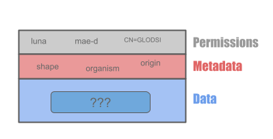

# ArtifactDB Backend

*ArtifactDB* is an "umbrella" name describing a type of API, built on top of this framework, and thus sharing the same
capabilities. The concept is simple: secure storage of arbitrary data along with searchable metadata. ArtifactDB
instances live close to the business and help collecting, organizing, cataloging rich domain-specific metadata. The data
itself is by design treated as a "blob".

### Permissions

An additional layer, containing permissions information, can be added to a set of data/metadata to implement
authorization and control the access of both the data, and the metadata.

### Architecture

The architecture of an ArtifactDB instance is pretty simple:

1. Data, metadata, permissions (and any other administrative metadata) are stored on AWS S3, considered the source of truth.
2. Metadata is indexed on Elasticsearch, using asynchronous tasks orchestrated by a backend. Permissions are also injected in the
   index to implement authorization.
3. A frontend REST API provides multiple endpoints to authenticate and authorize users, fetch, search metadata,
   orchestrate the storage and retrieval of data files from S3. Data on S3 cannot be accessed unless the corresponding
   metadata is accessible.

All ArtifactDB instances share the same features:

- Metadata must follow pre-defined JSON schemas. These schemas correspond to data types. They are converted into "models"
  used to make this metadata searchable through an efficient indexing engine (Elasticsearch)
- Fine-grained permissions can be defined using a Role Base Access Control (RBAC) pattern
- Data and metadata are organized and grouped as projects, with versioning support (with optional automatic provisioning
  of project identifiers and versions)
- Authentication is based on JWT tokens
- Each API provides unique Genomics Platform Resource Names, or "GPRNs"(see `artifactdb-identifiers` repo), to easily
  refer to any given resources within a platform (artifacts, projects, versions, changelog, documentation, etc...)
- Extensible with backend plugins, which can periodically run based on a schedule or based on certain events happening
  internally within ArtifactDB instances.
- Deployed as high performance, responsive and scalable REST APIs, built on top of Kubernetes, in the cloud.

