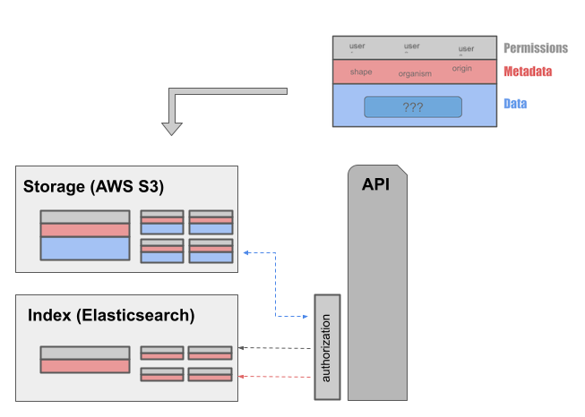
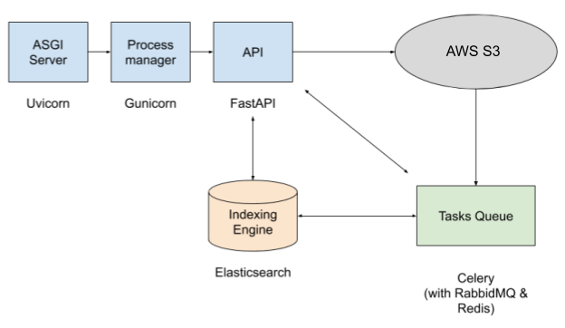
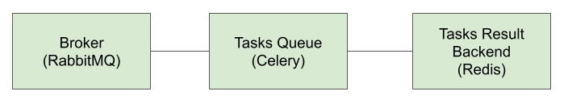
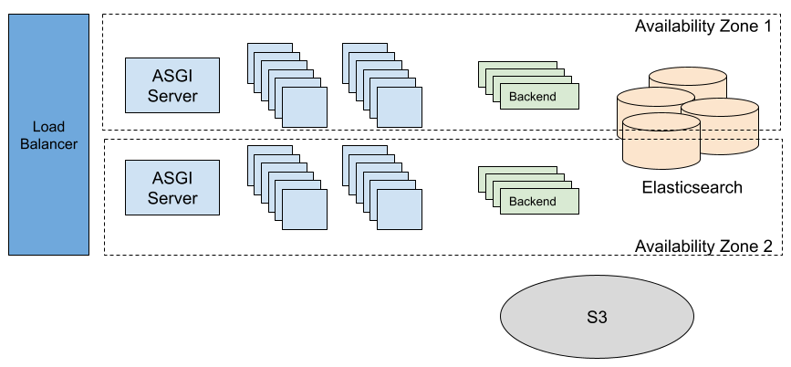

# Architecture

The architecture of an ArtifactDB instance is pretty simple:

1. Data, metadata, permissions (and any other administrative metadata) are stored on AWS S3, considered the source of truth.
2. Metadata is indexed on Elasticsearch, using asynchronous tasks orchestrated by a backend running Celery. Permissions
   are also injected in the index to implement authorization.
3. A frontend REST API provides multiple endpoints to authenticate and authorize users, fetch, search metadata,
   orchestrate the storage and retrieval of data files from S3. Data on S3 cannot be accessed unless the corresponding
   metadata is accessible.

These distributed components act a whole to a provide a scalable backend system.  The REST API is implemented using
[FastAPI](), a python framework dedicated to this type of API. A frontend instance, ie. FastAPI processes, is stateless
which makes it easy to scale, by just created more and more instances handling the traffic. AWS S3 is a object-store,
highly available and reliable.

Celery is used to orchestrate asynchronous backend tasks, like indexing metadata into Elasticsearch. Celery is organized
into a broker (RabbitMQ) handling the messaging and possibly queue priorities, a results backend (Redis by default, but
also Elasticsearch), a Cebery beat handling task periodic scheduling, and one or more Celery workers, on which tasks are
sent and processed. These workers are easily scalable too.

Redis also plays an important role, regardless of Celery, by providing distributed locks (to prevent a client to modify
the same project/version at the same time for instance) and several caches to the API (schemas, user authentication
information such as AD groups membership and more, public keys from OpenID Connect servers, backend remote tasks
definition, custom Elasticsearch scrollers, ...). This improves the stateless of the other components to allow easy
scaling up and down.

Finally, while in many cases the possible bottleneck could be the database itself, Elasticsearch is a distributed
database, also easy to scale by deployment more nodes to the cluster. This is obviously a limit to this, but it's not
rare to multi billions documents clusters (we're far from this number). The queries themselves can be costly though,
specially when performing aggregations, but that's pretty much the case for all databases (eg. joins in RDBMS).

ArtifactDB APIs are preferrably deployed on a Kubernetes cluster, to benefit from its ecosystem, resilience,
self-healing features. Frontend and backend pods are scaled easily and accordingly (though there's no dynamic scaling at
the moment).

TODO: move this
All ArtifactDB instances share the same features:

- Metadata must follow pre-defined JSON schemas. These schemas correspond to data types. They are converted into "models"
  used to make this metadata searchable through an efficient indexing engine (Elasticsearch)
- Fine-grained permissions can be defined using a Role Base Access Control (RBAC) pattern
- Data and metadata are organized and grouped as projects, with versioning support (with optional automatic provisioning
  of project identifiers and versions)
- Authentication is based on JWT tokens
- Each API provides unique Genomics Platform Resource Names, or "GPRNs"(see `artifactdb-identifiers` repo), to easily
  refer to any given resources within a platform (artifacts, projects, versions, changelog, documentation, etc...)
- Extensible with backend plugins, which can periodically run based on a schedule or based on certain events happening
  internally within ArtifactDB instances.
- Deployed as high performance, responsive and scalable REST APIs, built on top of Kubernetes, in the cloud.

