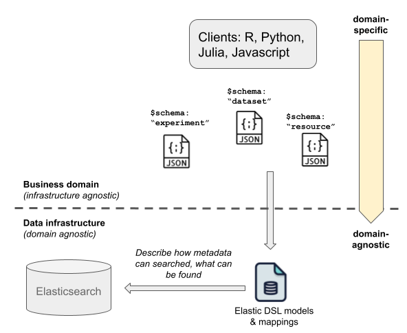

# Schemas

Each instance of an ArtifactDB API corresponds to one specific business use case, usually defined as the type of data
the API holds. ArtifactDB heavily relies on JSON schemas to specify the structure of the metadata collected by the
instances. Beyond ensuring and enforcing consistent metadata structure, the role of these JSON schemas is fundamental in
terms of process as it outlines the frontier between domain-specific activity operated by business users, and the
domain-agnostic Data Infrastructure itself.

From a technical perspective, JSON schemas are converted into Elasticsearch DSL models, themselves generating Elasticsearch mappings.
These mappings define what to index and how. JSON schemas can optionally be annotated to add extra information for the mapping
generation. For example, if a specific field needs to allow partial match searches (as opposed to exact match), it needs to be indexed
as a `text` field. Such information cannot be guessed automagically during the conversion step.

{width=400px}

Beside these rare exceptions, a clear separation exists between domain-specific (business) and domain-agnostic (infrastructure)
activities. This is even more emphasized if we add ArtifactDB clients to the picture. For example, clients handle specific
data structures (such as Multi Assay Experiments, MAE, in the R language) and is responsible for collecting data and metadata
from the API. These clients are close to the business so they can evolve quickly and efficiently, according to business
requirements. When metadata needs to evolve, business users, who are the most knowledgable for specifying metadata,
create or update JSON schemas and submit them to the ArtifactDB instance, through this conversion step.

## Constraints

In the current implementation, a field `path` must be present in each metadata document, thus at the root ant schema. It
represents the underlying data file path, within a project and version directories. This `path` field is mandatory as it
is used to build the file identifier, aka. [identifiers](ArtifactDB ID).

Note: if a metadata file doesn't reference a data file per se, the `path` must still be present. Its value is by
convention the path of the JSON metadata file itself.

The content of the schema, ie. metadata structure, can be anything, limited to the depth imposed by Elasticsearch and
its configuration, and/or the total numbe of indexed fields. This is usually not an issue, reaching these limits would
be an extreme case. Finally, the keys found at the root of the schema must not start with the character `_` (reserved
either by the ArtifactDB framework itself, eg. `_extra`, or Elasticsearch, eg. `_id`)

TODO: examples
