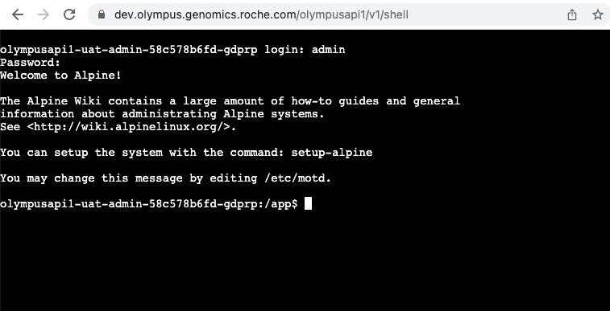
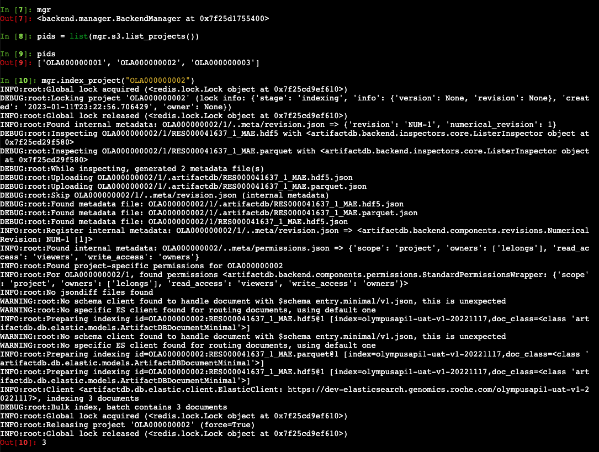

# Using the administration terminal

TODO: enable/disable terminal, maintainer operator, create admin users, wetty URL to connect, loading tools/admin.py,
examples, permissions

An administration terminal can optionally be deployed and used to access the ArtifactDB instance's internal. This
terminal exposes a pod shell from within the Kubernetes namespace. That pod contains the exacts same code being used by
the instance itself. A convenient script named `tools/admin.py` can be used to load and instantiate major components of
the instance, notably a backend manager instance, from which pretty much every operations are possible.

## Accessing the terminal

When enabled and active, the terminal can be access under the path prefix `/shell`, with any web browser. A Linux login
page is then displayed, asking for a username and password. Administration users need to be created first, either when
installing/upgrading the instance by providing a secret containing that list of users (recommended, part of the
deployment code), and after the deployment, by manually populating the secret, directly on the cluster (not recommended,
for temporary access setting only). See below on how to create these users.

Once logged, we land in bash terminal, within the admin pod living in the Kubernetes cluster.



Once logged, we can run the `tools/admin.py` script. This python script is present in all ArtifactDB instances, loads
commonly used libraries and instantiates major components. After running and displaying a horrendous (yet interesting)
amount of logs, the environement is loaded and a special variable `mgr` is available for us, reprensent a central
component, a backend manager instance.

```
$ ipython
In [1]: run tools/admin.py
Using config files: ['./etc/config-uat.yml']
...
...
INFO:root:Aliases found (index => alias): {'olympusapi1-uat-v1-20221117': 'olympusapi1-uat-v1'}
INFO:root:Aliases found (index => alias): {'olympusapi1-uat-v1-20221117': 'olympusapi1-uat-v1'}

In [2]: mgr
Out[2]: <backend.manager.BackendManager at 0x7f25d1755400>
```

From there, we can access all the manager's sub-components and interact with ArtifactDB, using python code and the
framework itself. Notably, `mgr.es` points to the ElasticSearch manager handling index queries, while `mgr.s3` deals
with data storage in general. You will find some examples throughout this documentation, using these admin pod, terminal
and `mgr` instance, as a conventional way to achieve advanced operations on ArtifactDB instances.

As a usage illustration, in the below example, we list all projects available from the storage, and index one of them.




## Activating/deactivating the terminal

```
# Assuming `tok` contains an admin token
> requests.put(
    url + "/maintenance/requests",
    json={"name": "scale-deployment", "args": ["admin",1]},
    headers={"Authorization":f"Bearer {tok}"}
)
<Response [200]>
# checking maintenance requests (before it's processed by the operator)
> requests.get(
    url + "/maintenance/status",
    headers={"Authorization":f"Bearer {tok}"}
).json()
{'state': None,
 'requests': [{'stage': None,
   'info': {'name': 'scale-deployment', 'args': ['admin', 1], 'kwargs': None},
   'created': '2023-01-11T22:05:09.524265',
   'owner': 'lelongs'}],
 'started_at': None,
 'stage': None,
 'owner': None,
 'info': {}}
# After a while, request was processed
> requests.get(
    client._url + "/maintenance/status",
    headers={"Authorization":f"Bearer {tok}"}
).json()
{'state': None,
 'requests': [],
 'started_at': None,
 'stage': None,
 'owner': None,
 'info': {}}
```

The terminal becomes accessible at `[url]/shell`.

To disable the terminal, we scale it down to 0
```
> requests.put(
    url + "/maintenance/requests",
    json={"name": "scale-deployment", "args": ["admin",0]},
    headers={"Authorization":f"Bearer {tok}"}
)
```

Accessing the terminal again will result in a "404 Not Found" error.


